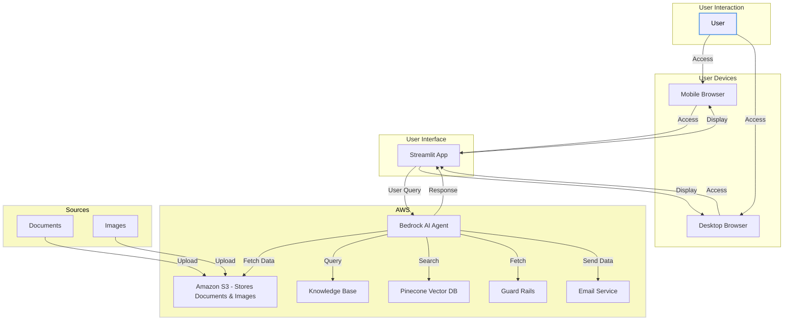

# AI Concierge

The AI Concierge is a sophisticated AI-powered assistant tailored for luxury condominium residents, providing personalized support and automation for daily needs, from scheduling services to organizing events. Built using AWS Bedrock and Claude 3 Haiku, it integrates with AWS Lambda and S3 to deliver seamless concierge experiences.

## Prerequisites

- Python 3.12 or higher
- AWS account with appropriate permissions for Lambda and S3
- AWS CLI configured with your credentials

## Setup

### 1. Install Dependencies

Before you begin, ensure all the required packages are installed by running:

```bash
pip install -r requirements.txt
```

### 2. Configure Environment Variables

Make sure to set up the required environment variables before running the agent. These variables are crucial for connecting to your AWS resources.

```bash
export LAMBDA_ROLE=REPLACE_WITH_LambdaRole
export S3_BUCKET=REPLACE_WITH_DataAnalysisS3Bucket
```

Replace `REPLACE_WITH_LambdaRole` with your actual Lambda role ARN and `REPLACE_WITH_DataAnalysisS3Bucket` with the name of your S3 bucket used for data analysis.

### 3. Running the Agent

To run the agent, execute:

```bash
streamlit run ai_gent.py
```

This will start the AI agent and allow it to interact with AWS services as configured.

## Usage

Designed for a high-end residential environment, this concierge application offers:

- Automates requests for common building services like booking amenities, arranging deliveries, and managing reservations.
- Sends notifications and emails to update residents on requests, bookings, and other essential communications.
- Provides answers on building policies, bylaws, and rules.

## Architecture



## License

AWS Amazon
